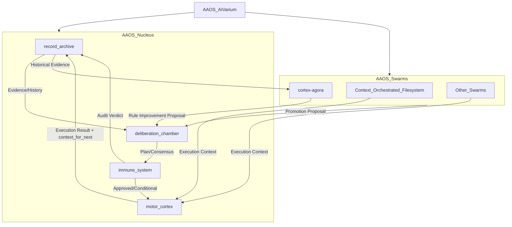

# AAOS Nucleus (Planning Snapshot)

AAOS의 Nucleus 기관 레이어를 AIVarium 관점에서 요약한 운영 스냅샷.
현재 구조는 `motor_cortex` 실행 기관을 포함한 4기관 체계로 정렬되어 있다.

## System Map



## Institution Roles

- `record_archive`: append-only 증빙, audit/meta-audit, hash ledger 보존
- `immune_system`: 최종 판정(승인/보류/거부), 권한/정합성 심판
- `deliberation_chamber`: 문제 구조화, 토폴로지 설계, 합의 산출물 관리
- `motor_cortex`: 실행 오케스트레이션, 검증 실행, 실패 시 `on_conflict` 귀속

## Runtime Verification (2026-02-14)

실행 검증 명령:

```bash
python3 01_Nucleus/motor_cortex/scripts/nucleus_ops.py health --json
python3 01_Nucleus/motor_cortex/scripts/nucleus_ops.py supervision-check --json
python3 01_Nucleus/motor_cortex/scripts/nucleus_ops.py supervision-cycle
python3 01_Nucleus/motor_cortex/scripts/nucleus_ops.py workflow-audit 01_Nucleus/motor_cortex/templates/WORKFLOW_TRACE_MANIFEST_TEMPLATE.md
python3 01_Nucleus/motor_cortex/scripts/plan_manager.py list --active
```

검증 요약:

- `critical_ok: true`
- `supervision-check: ok false` (required issue 1, recommendation 1)
- `supervision-cycle: needs-improvement` (자동 봉인 완료)
- `workflow-audit: ok true`
- `plan_manager list --active: (없음)`
- SQLite 운영 로그 경로: `01_Nucleus/motor_cortex/context/agent_log.db`
- supervision package:
  - `01_Nucleus/record_archive/_archive/operations/20260214T071342Z__ops-supervision__swarm-manifestation/`

## Canonical References

- Canon: `README.md`
- META Doctrine: `00_METADoctrine/DNA.md`
- Nucleus Core: `01_Nucleus/README.md`
- Nucleus Workflow: `01_Nucleus/motor_cortex/governance/AGENTIC_WORKFLOW_ORCHESTRATION.md`
- Nucleus Skills Playbook: `01_Nucleus/motor_cortex/governance/GLOBAL_SKILLS_PLAYBOOK.md`
- Motor Cortex DNA: `01_Nucleus/motor_cortex/DNA.md`
