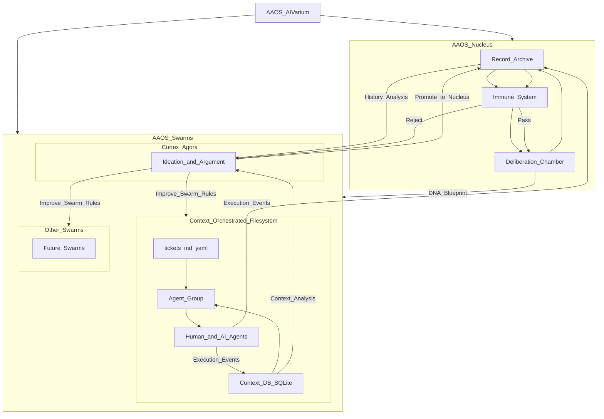

# AAOS Nucleus (Planning)

AAOS의 **Nucleus(핵심 기관 레이어)** 를 AIVarium 전체 구조 안에서 조망하기 위한 *planning 문서*.

- Canonical source of truth: `04_Agentic_AI_OS/`
- 이 문서의 역할: 구조/관계/경계 정의를 초안으로 잡고, 필요 시 Deliberation/Immune Gate를 거쳐 Canonical 문서로 승격

## System Map (Draft)

## Canonical References

- Canon: [README.md](../README.md)
- META Doctrine: [METADoctrine.md](../METADoctrine.md)
- Deliberation Chamber DNA: [DNA_BLUEPRINT](../01_Nucleus/Deliberation_Chamber/DNA_BLUEPRINT.md)
- COF (Context Orchestrated Filesystem): [COF v0.1.3 DNA](../02_Swarm/Context-Orchestrated-Filesystem/DNA.md)
