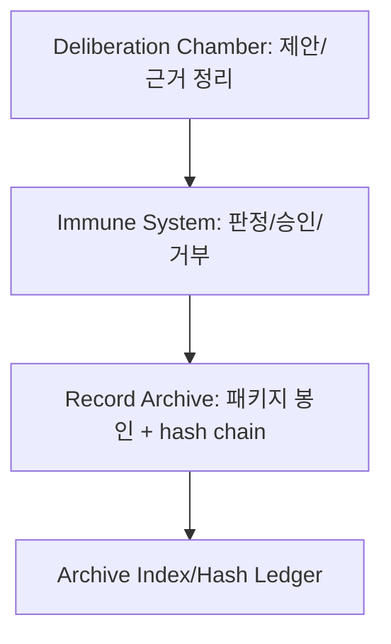

# AAOS Record Archive System

> AIVarium.Nucleus 구성 요소: “기억(증빙) 보존”을 담당한다.

Record Archive는 판정/합의/승인/해체 이력을 **append-only**로 보존하고,
정통성 분쟁 시 재현 가능한 근거를 제공한다.

## 운영 정렬

- 상위 규범은 Canon 및 META Doctrine이 우선한다.
- 문헌 규칙은 `homing_instinct`를 따른다. 충돌/권한 경계 불명확 시 즉시 중단하고 상위기관으로 귀속한다.
- 증빙 패키지는 `_archive/<bucket>/<timestamp>__<type>__<slug>/` 규격을 사용한다.

## 구성

```text
01_Nucleus/record_archive/
├── README.md
├── DNA.md
├── _archive/
│   ├── audit-log/
│   ├── meta-audit-log/
│   ├── deliberation/
│   ├── approvals/
│   ├── snapshots/
│   └── disputed/
├── indexes/
│   ├── README.md
│   ├── ARCHIVE_INDEX.md
│   └── HASH_LEDGER.md
├── templates/
└── scripts/
```

## 핵심 규칙

1. `HASH_LEDGER.md`는 `scripts/ledger_keeper.py`로만 갱신한다(수동 편집 금지).
2. 패키지는 `PACKAGE.md` + `MANIFEST.sha256` + `payload/` 최소 구성을 반드시 갖춘다.
3. 정합성 상의 의심이 있으면 작업을 중단하고 Inquisitor로 귀속한다.
4. 상위기관 변경 또는 DNA 변경은 증빙 패키지 1개 이상을 의무 봉인한다.
5. 모든 증빙은 `ARCHIVE_INDEX.md`와 `HASH_LEDGER.md` 체인에서 추적 가능해야 한다.
6. record_archive에 `pending/`, `working/` 등 작업용 디렉토리를 생성하지 않는다. 활성 작업 산출물은 `deliberation_chamber`에서 관리하며, 봉인 완료된 증빙만 `_archive/`로 수용한다.

## 상위 변경 게이트 및 합의 추적

- Canon, META, 기관 DNA, Swarm 루트 DNA 등 상위 변경은 `Record Archive` 봉인 의무를 가진다.
- 최소 산출물: Deliberation packet, Immune 판정/승인 근거, 원본/요약 본문, `MANIFEST.sha256`, 체인 엔트리.
- model_id/model_family/provider/rationale를 포함한 다중 합의 항목을 함께 보관한다.

## 빠른 패키지 절차

1. `_archive/<bucket>/`에 패키지 폴더 생성
2. `templates/ARCHIVE_PACKAGE_TEMPLATE.md` 기반 `PACKAGE.md` 작성
3. `payload/`에 증빙 저장, `MANIFEST.sha256` 생성
4. `ledger_keeper.py`로 봉인 (아래 CLI 참조)
5. `indexes/ARCHIVE_INDEX.md`와 `indexes/HASH_LEDGER.md`가 자동 갱신됩니다.

## ledger_keeper.py CLI

```bash
# 권장 CLI (seal command)
python3 scripts/ledger_keeper.py seal <package_path> \
  --summary "ARCHIVE_INDEX에 표시할 요약" \
  --targets "대상파일1.md,대상파일2.md" \
  --notes "HASH_LEDGER notes 필드"

# 무결성 검증
python3 scripts/ledger_keeper.py verify
# 또는 (하위 호환)
python3 scripts/ledger_keeper.py --verify

# 드라이런
python3 scripts/ledger_keeper.py seal <package_path> --summary "test" --dry-run
```

**주요 파라미터:**

| 파라미터 | 설명 | 기본값 |
|----------|------|--------|
| `--summary` | ARCHIVE_INDEX `summary` 필드 | notes 또는 "auto-recorded package" |
| `--targets` | 쉼표 구분 대상 파일 경로 → ARCHIVE_INDEX `targets` | 패키지 경로 자체 |
| `--notes` | HASH_LEDGER `notes` 필드 | (빈 문자열) |
| `--dry-run` | 실제 기록 없이 결과 확인 | false |

## 검증 규칙

- `HASH_LEDGER.md`는 `CHAIN_MIGRATION.marker`(2026-02-14T00:00:00Z)를 경계로, 이전은 `manifest-only`, 이후는 `prev_hash + manifest` 체인 방식으로 검증합니다.
- 검증기는 다음 케이스를 **WARN**으로 허용합니다:
  - `pre-migration chain hash`: CHAIN_MIGRATION 이전에 이미 chain 방식으로 해시된 엔트리
  - `repair entry`: 동일 `package_path`에 repair 엔트리가 존재하여 MANIFEST 수정이 기록된 경우

```bash
# 검증 예시 (pass with warnings)
python3 scripts/ledger_keeper.py verify
#   WARN: 8) pre-migration chain hash detected for ... (accepted)
#   WARN: 12) hash mismatch for ... (repair entry, accepted)
# OK: HASH_LEDGER verification passed (15 entries, 4 warnings)
```

## Repair 엔트리 규칙

MANIFEST.sha256가 봉인 후 수정된 경우:
1. 원본 엔트리의 해시 불일치는 불가피 (append-only 원칙)
2. repair 엔트리를 추가하여 새 MANIFEST 해시를 체인에 반영
3. 동일 `package_path`가 2회 이상 등록된 경우 검증기가 repair로 인식하여 WARN 처리



## 운영 예시

```bash
# 봉인 (새 CLI)
python3 scripts/ledger_keeper.py seal \
  _archive/approvals/2026-02-14T...__approval__example/ \
  --summary "approval for DNA v0.3.0" \
  --targets "01_Nucleus/record_archive/DNA.md" \
  --notes "approval packet sealed"

# 봉인 (하위 호환 CLI)
python3 scripts/ledger_keeper.py _archive/approvals/2026-02-14T...__approval__example/ "approval packet sealed"
```
