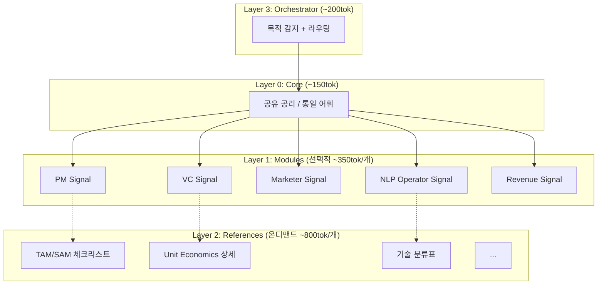
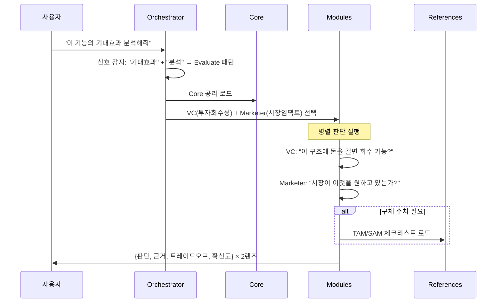
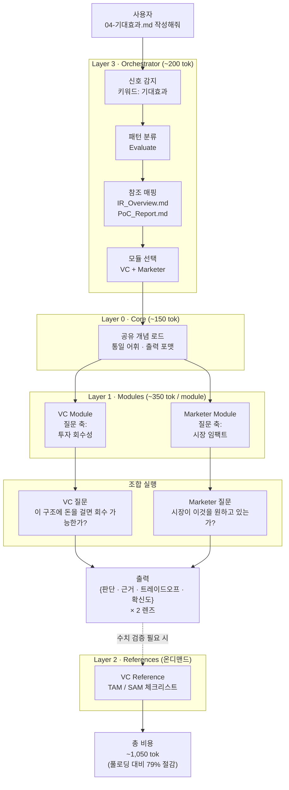

# 4-Layer Mental Model Orchestrator Architecture

상태: 완료
생성 일시: 2026년 2월 4일 오후 10:01

> **목적**: LLM 기반 멘탈모델 스킬의 토큰 비용 최적화와 품질 극대화를 위한 계층형 아키텍처 설계
**날짜**: 2025-02-04
**저자**: Woody × Claude
**상태**: Architecture Design Complete → Implementation Ready
> 

---

# 1. 문제 인식

### 1.1 현재 구조의 한계

현재 멘탈모델 스킬은 **역할(Role) 기반**으로 설계되어 있다.

```
pm-mental-model/      ← SKILL.md (~1,200tok) + references 6개 (~7,500tok)
vc-mental-model/      ← SKILL.md (~2,100tok) + references 9개 (~17,000tok)
```

두 프레임을 동시 사용하면 최악의 경우 **~27K 토큰**이 컨텍스트에 로드된다. 여기에 실제 사용 가능한 멘탈모델 5개(PM, VC, Marketer, NLP Operator, Revenue Diversification)를 고려하면 문제는 더 심화된다.

### 1.2 핵심 문제 3가지

| 문제 | 설명 | 영향 |
| --- | --- | --- |
| **토큰 낭비** | 매 호출마다 전체 스킬을 로딩 | 비용 증가 |
| **어휘 충돌** | 같은 개념을 다른 단어로 정의 (예: PM의 "Expected Value" vs VC의 "Expected Value") | 품질 저하 |
| **조합 폭발** | N개 모듈 × M개 섹션 × P개 패턴 | 관리 불가 |

---

# 2. 토큰 비용 모델

### 2.1 기본 변수 정의

| 변수 | 의미 | 추정값 |
| --- | --- | --- |
| S | 스킬 파일 크기 (SKILL.md) | ~1,000–2,100tok |
| R | Reference 파일 합계 | ~7,500–17,000tok |
| P | 사용자 프롬프트 | ~800tok |
| O | 모델 출력 | ~500tok |
| r | 맥락 전달률 (Agent 분기 시) | ~0.3 |
| N | 워크플로우 Step 수 | 가변 |

### 2.2 A안 vs B안 비교

**A안: Multi-Agent (분기)**

```
T_A = N × (S + rO + P + O)
    = N × (S + 0.3×500 + 800 + 500)
    = N × (S + 1,450)
```

맥락 손실이 있지만, 각 호출이 가볍다.

**B안: 프레임 전환 (단일 컨텍스트)**

```
T_B = Σᵢ(Sᵢ) + N × (P + O)
    = (S₁ + S₂ + ... + Sₖ) + N × 1,300
```

맥락 100% 유지되지만, 스킬이 누적된다.

### 2.3 손익분기점

B안이 A안보다 효율적인 조건:

$$
N^* ≈ \frac{2[rO + (S - L_0 - L_1)]}{O} ≈ 3.0
$$

**N ≥ 3 Step**이면 B안(프레임 전환)이 유리하다. 대부분의 실무 작업은 이 조건을 충족한다.

---

# 3. 품질 보정 모델

### 3.1 효용 함수

토큰 비용만이 아니라 **품질**을 함께 고려해야 한다:

$$
U = \alpha \cdot \frac{Q_1 \cdot Q_2}{T}
$$

| 변수 | 의미 |
| --- | --- |
| Q₁ | 맥락 보존 품질 (0–1) |
| Q₂ | 렌즈 정밀도 (0–1) |
| T | 토큰 비용 |
| α | 직교성 계수 (0.5–0.9) |

### 3.2 직교성 계수 α

수학에서 직교(orthogonal)란 두 벡터가 90°로 만나서 **서로 간섭이 0**인 상태다.

**비직교 설계 (현재)**

```
PM: "이 제품이 팔수록 남는 구조인가?" (Unit Economics)
VC: "LTV/CAC > 3x인가?"              (Unit Economics)
→ 같은 질문을 다른 단어로 → 간섭 발생 → α ≈ 0.5
```

**직교 설계 (제안)**

```
PM: "사용자가 이것을 반복 사용할 구조인가?" (습관 루프)
VC: "이 구조에 돈을 걸면 회수할 수 있는가?" (투자 회수성)
→ 각 모듈이 고유 질문 축 소유 → α ≈ 0.9
```

## 3.3 직교 설계 원칙 3가지

| 원칙 | 설명 |
| --- | --- |
| **공유 개념은 Core에** | 중복 정의 제거 → Layer 0에 한 번만 |
| **고유 질문 축** | 각 모듈은 자신만의 질문으로 정의 |
| **통일 출력 형식** | `{판단, 근거, 트레이드오프, 확신도}` |

---

# 4. 4계층 아키텍처 설계

### 4.1 구조 개요



### 4.2 각 레이어 역할

| Layer | 이름 | 크기 | 로딩 조건 | 역할 |
| --- | --- | --- | --- | --- |
| **3** | Orchestrator | ~200tok | 항상 | 목적 감지, 패턴 분류, 모듈 라우팅 |
| **0** | Core | ~150tok | 항상 | 공유 공리, 통일 어휘, 출력 형식 |
| **1** | Modules | ~350tok/개 | 선택적 | 도메인별 고유 질문 축 (시그널) |
| **2** | References | ~800tok/개 | 온디맨드 | 상세 체크리스트 (L2 필요 시) |

### 4.3 L2 로딩 조건

References는 항상 로딩하지 않는다. 로딩 기준:

$$
\frac{\Delta Q}{L_2} > \frac{\Delta Q}{L_1}
$$

즉, Reference 로딩으로 인한 품질 향상이 Layer 1 시그널만으로 얻는 향상보다 클 때만 로딩한다. 실무적으로는 **구체적 수치 검증이 필요한 경우**(예: TAM 추정, TRL 등급 판정)에만 L2를 로딩한다.

---

# 5. Orchestrator 패턴 감지

### 5.1 6가지 핵심 패턴

Orchestrator는 사용자 입력에서 **목적 신호**를 감지하고, 적절한 모듈 조합과 실행 모드를 결정한다.

| 신호 키워드 | 패턴 | 조합 방식 | 설명 |
| --- | --- | --- | --- |
| "평가해줘", "분석해줘" | **Evaluate** | 병렬 렌즈 판단 | 각 모듈이 독립적으로 판단 |
| "검증해줘", "반박해봐" | **Critique** | A 생성 → B 공격 | 적대적 검증 |
| "어떻게 보일까" | **Simulate** | 병렬 페르소나 | 다중 관점 시뮬레이션 |
| "번역해줘", "IR로" | **Translate** | A 언어 → B 재구성 | 프레임 간 언어 변환 |
| "우선순위", "뭐부터" | **Prioritize** | 단일 모듈 심층 | 하나의 렌즈로 깊이 분석 |
| "비교해줘", "트레이드오프" | **Arbitrate** | 명시적 상충 추출 | 모듈 간 갈등을 구조화 |

### 5.2 조합 실행 흐름 예시



---

# 6. 수학적 비용 모델

### 6.1 단일 Step 비용

```
Cᵢ = Ω + L₀ + Dᵢ·L₁ + mᵢ·L₂ + P + O
```

| 변수 | 의미 | 추정값 |
| --- | --- | --- |
| Ω | Orchestrator | ~200tok |
| L₀ | Core | ~150tok |
| Dᵢ | 활성 도메인 수 | 1–3 |
| L₁ | 모듈당 크기 | ~350tok |
| mᵢ | 로딩되는 Reference 수 | 0–2 |
| L₂ | Reference당 크기 | ~800tok |
| P | 프롬프트 | ~800tok |
| O | 출력 | ~500tok |

### 6.2 N Step 총 비용

```
T_total = Σᵢ₌₁ᴺ [Ω + L₀ + Dᵢ·L₁ + mᵢ·L₂ + P + (i-1)(O+δ)]
```

δ는 누적 출력 오버헤드.

### 6.3 최적 윈도우 K*

하이브리드 방식(K개 Step을 하나의 컨텍스트 윈도우에서 실행 후 새 윈도우 시작)의 최적 크기:

$$
K^* = \sqrt{\frac{2(L_0 + \bar{D}L_1 + \bar{m}L_2 + P + O - rO)}{O + \delta}}
$$

K* ≈ 2–3이 일반적인 최적값이다.

---

# 7. 효과 검증: 현재 vs 4계층

### 7.1 PM+VC 2모듈 비교

| 항목 | 현재 (풀로딩) | 4계층 Orchestrator |
| --- | --- | --- |
| 시스템 프롬프트 | ~3,300tok | ~1,050tok |
| 어휘 충돌 | 있음 (α≈0.5) | 없음 (α≈0.9) |
| 품질 Q₁·Q₂ | ~0.56 | ~0.81 |
| 효용 U = αQ/T | **기준 1.0x** | **3.0x** |

### 7.2 5모듈 전체 비교

| 항목 | 현재 | 4계층 |
| --- | --- | --- |
| 전체 로딩 시 | ~5,000tok+ | 선택적 ~1,000–2,000tok |
| 토큰 절감률 | — | **60–80%** |
| 모듈 선택 | 수동 / 전체 | 자동 라우팅 |
| 품질 계수 α | ~0.5 | ~0.9 |

---

# 8. 실전 케이스 스터디: R&D 계획서

### 8.1 프로젝트 개요

**모 연구개발계획서** 작성 프로젝트에 4계층 Orchestrator를 적용한 분석이다.

- **43개 섹션**을 기획 파일에서 최종 문서로 변환
- **5개 멘탈모델** 사용 가능: PM, VC, Marketer, NLP Operator, Revenue
- **2개 문서 파이프라인**: long-document-production, operational-editing
- 워크플로우: `05.write_planning/` → `06.writing/` → 최종 제출

### 8.2 핵심 문제: 섹션마다 필요한 렌즈가 다르다

| 섹션 유형 | 예시 | 필요 모듈 | D (도메인 수) |
| --- | --- | --- | --- |
| 연구목표/추진전략 | 과제명, 목표, 로드맵 | PM | 1 |
| 기술 상세 | 기술분류, 연구내용, TRL | NLP Operator | 1 |
| 사업화/시장성 | 기대효과, 시장 포지셔닝 | VC + Marketer | 2 |
| 수익 모델 | 사업화 계획, 활용계획 | Revenue + VC | 2 |
| 위험/대응 | 기술적 위험, 대응전략 | PM + NLP Operator | 2 |

**풀로딩 방식이면** 5개 모듈을 매번 로딩 → 섹션당 ~5,000tok+ 낭비.

### 8.3 Orchestrator 라우팅 실행 예시



### 8.4 43개 섹션 자동 라우팅 테이블

| 패턴 | 해당 섹션 (예시) | 모듈 조합 | 모드 |
| --- | --- | --- | --- |
| **Prioritize** | 과제명, 연구목표 | PM 단독 | 심층 단일 |
| **Evaluate** | 기대효과, 시장성 분석 | VC + Marketer 병렬 | 각 렌즈 판단 병렬 |
| **Translate** | 기술→사업화 변환 | NLP Op → VC 재구성 | 언어 변환 |
| **Critique** | 위험 분석, 대응전략 | PM 생성 → NLP Op 공격 | 적대적 검증 |
| **Arbitrate** | 예산 배분, 우선순위 | PM + Revenue 트레이드오프 | 상충점 추출 |
| **Simulate** | 활용계획, 확산전략 | Marketer + Revenue 페르소나 | 병렬 시뮬레이션 |

### 8.5 비용 비교 분석

**현재 방식 (Agent마다 풀로딩)**

```
T_현재 = 43 × (S₁ + S₂ + S₃ + S₄ + S₅ + P + O)
       = 43 × (~5,000 + 800 + 500)
       ≈ 270,900 tok
```

**4계층 Orchestrator (선택적 로딩)**

```
T_new = Σᵢ₌₁⁴³ [Ω + L₀ + Dᵢ·L₁ + mᵢ·L₂ + P + O]

평균 D̄ ≈ 1.7, 평균 m̄ ≈ 0.3 일 때:
= 43 × [200 + 150 + 1.7×350 + 0.3×800 + 800 + 500]
= 43 × [200 + 150 + 595 + 240 + 800 + 500]
= 43 × 2,485
≈ 106,855 tok
```

**→ 절감: 61%** (271K → 107K tok)

### 8.6 배치 최적화

동일 모듈 조합끼리 그룹화하면 K* 윈도우 내에서 맥락을 재활용할 수 있다:

```
Batch 1 (PM 단독):     과제명, 연구목표, 추진전략...  → K*=2~3씩
Batch 2 (VC+Marketer):  기대효과, 시장성...          → K*=2씩
Batch 3 (NLP Op 단독):  기술분류, 연구내용, TRL...   → K*=2~3씩
Batch 4 (교차):         위험분석, 사업화...           → K*=2씩

```

배치 내에서 L₀+L₁ 재로딩이 불필요하므로:

```
T_batch ≈ 43 × [Dᵢ·L₁·(1/K*) + P + O] + B × [Ω + L₀ + D̄·L₁]
```

**→ 추가 ~20% 절감 → 총 ~70% 절감** (271K → ~81K tok)

### 8.7 종합 비교표

| 지표 | 현재 | Orchestrator | 배치 최적화 |
| --- | --- | --- | --- |
| 섹션당 비용 | ~6,300 tok | ~2,485 tok | ~1,884 tok |
| 43섹션 총비용 | ~271K tok | ~107K tok | ~81K tok |
| 모듈 선택 | 수동/전체 로딩 | 자동 라우팅 | 자동 배칭 |
| 품질 (α) | ~0.5 | ~0.9 | ~0.9 |
| 효용 (U) | 1.0x | 3.4x | **4.5x** |

---

# 9. 모듈 설계 규약

### 9.1 3원칙

| 원칙 | 현재 | 직교 설계 |
| --- | --- | --- |
| **참조 분리** | 각 모듈이 독립 정의 | 공유 개념은 Core에, 모듈은 delta만 |
| **고유 질문** | PM과 VC가 유사 질문 | 각 모듈이 자기만의 축 |
| **출력 통일** | 모듈마다 다른 형식 | `{판단, 근거, 트레이드오프, 확신도}` |

### 9.2 모듈별 고유 질문 축

| 모듈 | 고유 질문 | 비고 |
| --- | --- | --- |
| **PM** | "사용자가 이것을 반복 사용할 구조인가?" | 습관 루프 |
| **VC** | "이 구조에 돈을 걸면 회수할 수 있는가?" | 투자 회수성 |
| **Marketer** | "시장이 이것을 원하고 있는가?" | 시장 수요 |
| **NLP Operator** | "이 기술이 문제를 해결하는 최적 경로인가?" | 기술 적합성 |
| **Revenue** | "이 구조가 반복적 수익을 만드는가?" | 수익 지속성 |

---

# 10. 구현 로드맵

### 10.1 Phase 1: Core + 2 Modules

```
mental-model-core.md         ← Layer 0 (~150tok)
mental-model-orchestrator.md ← Layer 3 (~200tok)
mental-model-pm.md           ← Layer 1 PM Signal (~350tok)
mental-model-vc.md           ← Layer 1 VC Signal (~350tok)
```

검증: 기존 PM+VC 풀로딩 대비 토큰 절감과 α 개선 측정

### 10.2 Phase 2: 전체 모듈 + References

```
mental-model-marketer.md     ← Layer 1 추가
mental-model-nlp-op.md       ← Layer 1 추가
mental-model-revenue.md      ← Layer 1 추가
references/                  ← Layer 2 온디맨드 파일들
```

### 10.3 Phase 3: 배치 최적화

- K* 윈도우 기반 배치 그룹화 로직
- 패턴 감지 정확도 벤치마크
- 실제 R&D 계획서 프로젝트에 적용 및 측정

### 10.4 핵심 성공 지표

| 지표 | 목표 |
| --- | --- |
| 토큰 절감률 | ≥ 60% (풀로딩 대비) |
| 직교성 계수 α | ≥ 0.85 |
| 패턴 라우팅 정확도 | ≥ 90% |
| 효용 개선 | ≥ 3.0x |

---

# 11. 핵심 인사이트

### 11.1 아키텍처 수준

> **"역할(Role) 기반에서 목적(Purpose) 기반으로 스킬 단위를 재편하라."**
> 

현재 pm-mental-model, vc-mental-model처럼 역할 단위로 분리된 구조는 조합 시 어휘 충돌과 중복 로딩이 불가피하다. 4계층 아키텍처는 공유 개념(Core), 고유 시그널(Module), 상세 참조(Reference)를 분리하고, Orchestrator가 목적에 따라 동적 조합함으로써 이 문제를 구조적으로 해결한다.

### 11.2 비용 수준

> **"N ≥ 3 도메인, 다수 섹션 프로젝트에서 Orchestrator의 ROI가 극대화된다."**
> 

R&D 계획서처럼 43개 섹션에 5개 모듈이 존재하되, 각 섹션은 1–2개 모듈만 필요한 구조가 Orchestrator의 최적 적용 영역이다. 풀로딩은 60–80%의 토큰을 낭비하고, 자동 라우팅은 이를 구조적으로 제거한다.

### 11.3 품질 수준

> **"토큰을 줄이면서 품질이 올라가는 것은 직교 설계 덕분이다."**
> 

일반적으로 비용 절감과 품질 향상은 트레이드오프 관계다. 그러나 직교 설계는 간섭을 제거함으로써 두 가지를 동시에 달성한다. α가 0.5→0.9로 개선되면, 토큰이 60% 줄어도 효용은 3.4배 증가한다.

---

## 부록: 수식 요약

| 수식 | 의미 |
| --- | --- |
| `N* ≈ 2[rO + (S - L₀ - L₁)] / O ≈ 3.0` | 프레임 전환 손익분기점 |
| `U = α · Q₁ · Q₂ / T` | 효용 함수 |
| `Cᵢ = Ω + L₀ + Dᵢ·L₁ + mᵢ·L₂ + P + O` | 단일 Step 비용 |
| `K* = √(2(L₀ + D̄L₁ + m̄L₂ + P + O - rO) / (O+δ))` | 최적 윈도우 크기 |
| `ΔQ/L₂ > ΔQ/L₁` | L2 로딩 조건 |

