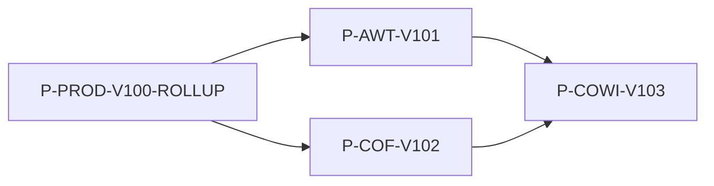

# P-PROD-V100-ROLLUP

## Purpose
- Track production-only proposal execution across AWT, COF, and COWI.

## Child Proposals
- [P-AWT-V101-WORKFLOW-GENERATION](../../agentic-workflow-topology/proposals/P-AWT-V101-WORKFLOW-GENERATION.md)
- [P-COF-V102-CONTEXT-GOVERNANCE](../../context-orchestrated-filesystem/proposals/P-COF-V102-CONTEXT-GOVERNANCE.md)
- [P-COWI-V103-PRODUCTION-HUB](./P-COWI-V103-PRODUCTION-HUB.md)

## Dependency DAG

## Report
- [Closure Summary](../reports/20260215__p-prod-v100__closure-summary.md)
